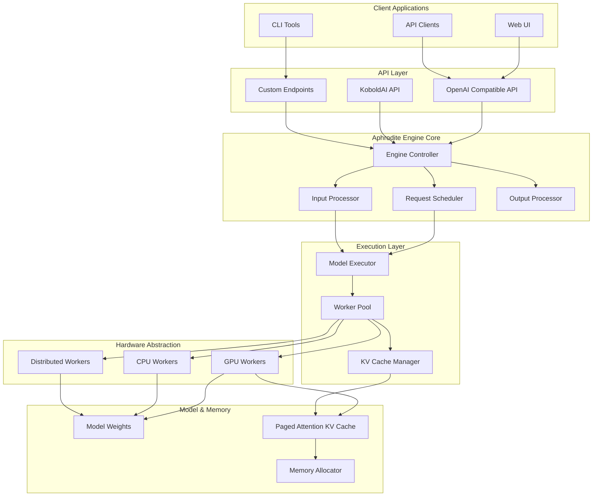
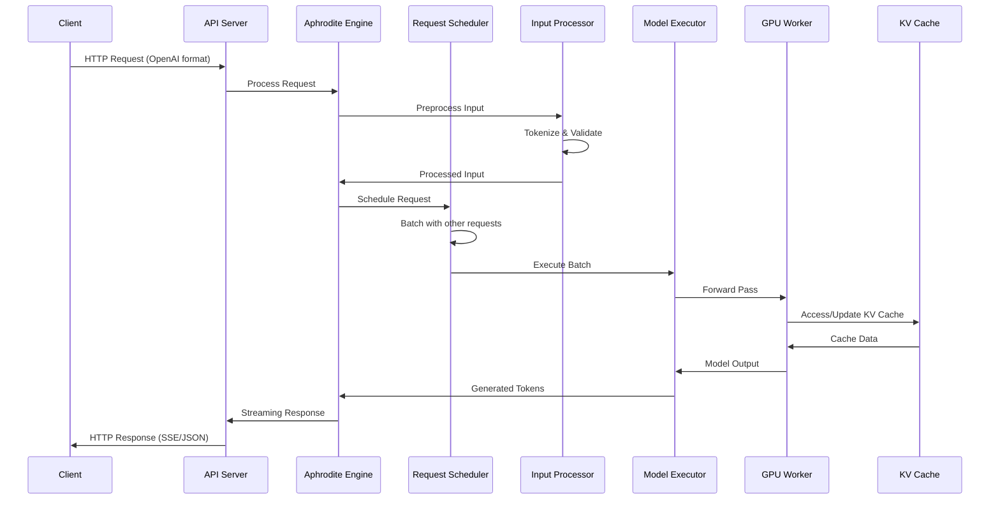
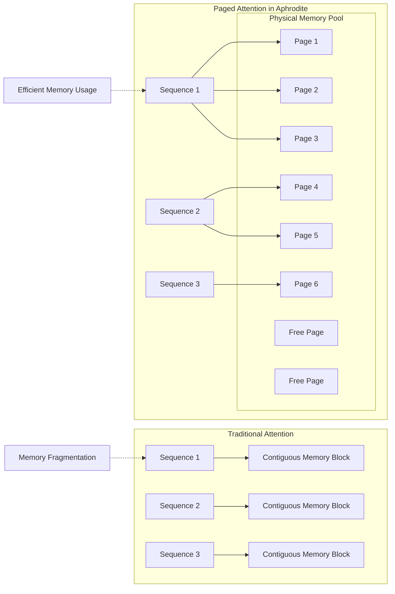
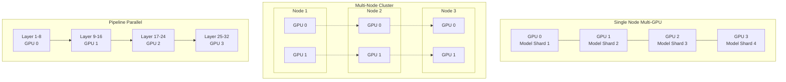
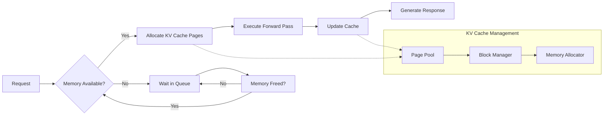
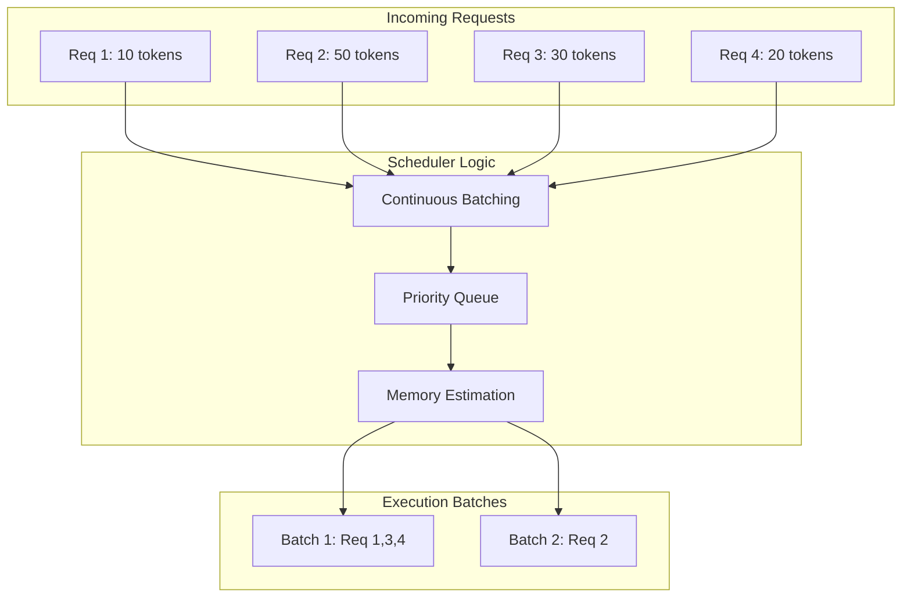

<h1 align="center">
Breathing Life into Language
</h1>


Aphrodite is a high-performance inference engine that optimizes the serving of HuggingFace-compatible language models at scale. Built on vLLM's Paged Attention technology, it delivers efficient model inference for multiple concurrent users with advanced memory management and distributed execution capabilities. Developed through a collaboration between [PygmalionAI](https://pygmalion.chat) and [Ruliad](https://ruliad.co), Aphrodite serves as the backend engine powering both organizations' chat platforms and API infrastructure.

Aphrodite builds upon and integrates the exceptional work from [various projects](#acknowledgements), primarily [vLLM](https://vllm.ai).

## 🏗️ Architecture Overview

Aphrodite's architecture is designed for scalability, efficiency, and ease of use. The system consists of several key components working together to provide high-performance LLM inference:



### Request Processing Flow

The following diagram shows how requests flow through Aphrodite's processing pipeline:



### Memory Management with Paged Attention

Aphrodite uses an advanced memory management system based on Paged Attention for efficient KV cache handling:



> [!CAUTION]
> This project is not, and will never be, associated with any cryptocurrencies. Please do not fall for scams.


## 🔥 News
(09/2024) v0.6.1 is here. You can now load FP16 models in FP2 to FP7 quant formats, to achieve extremely high throughput and save on memory.

(09/2024) v0.6.0 is released, with huge throughput improvements, many new quant formats (including fp8 and llm-compressor), asymmetric tensor parallel, pipeline parallel and more! Please check out the [exhaustive documentation](https://aphrodite.pygmalion.chat) for the User and Developer guides.

## ✨ Features

### Core Engine Features
- **🔄 Continuous Batching**: Dynamically batches requests for optimal GPU utilization
- **📄 Paged Attention**: Efficient K/V cache management with [PagedAttention](https://vllm.ai) from vLLM
- **⚡ Optimized CUDA Kernels**: Custom kernels for improved inference performance
- **🎯 Advanced Sampling**: Support for modern samplers such as DRY, XTC, and more

### Memory & Performance
- **🗄️ 8-bit KV Cache**: Higher context lengths and throughput with FP8 E5M3 and E4M3 formats
- **🔧 Memory Optimization**: Smart memory allocation and garbage collection
- **📊 Dynamic Batching**: Intelligent request scheduling and batching strategies

### Model Support & Quantization
- **🤗 HuggingFace Integration**: Run almost any HuggingFace-compatible model
- **⚖️ Quantization Support**: AQLM, AWQ, Bitsandbytes, GGUF, GPTQ, QuIP#, Smoothquant+, SqueezeLLM, Marlin, FP2-FP12, and more
- **🔀 Model Adapters**: Efficient deployment of LoRAs with Punica and PEFT-style Prompt adapters

### Distributed Computing
- **🌐 Multi-GPU Support**: Tensor parallel and pipeline parallel execution
- **☁️ Distributed Inference**: Scale across multiple nodes
- **🔗 Ray Integration**: Built-in Ray support for distributed deployments

### API & Integration
- **🔌 OpenAI-Compatible API**: Drop-in replacement for OpenAI API
- **👁️ Vision Support**: Multi-modal inputs including images
- **📦 Batch Processing**: Efficient batch API for high-throughput scenarios
- **🛠️ Tool Calling**: Function calling and tool integration support

### Hardware Support
- **🎮 NVIDIA GPUs**: Full CUDA support with optimized kernels
- **🔴 AMD GPUs**: ROCm support for AMD hardware
- **🧠 Intel Hardware**: Support for Intel XPUs and CPUs with AVX2/AVX512
- **☁️ Cloud Platforms**: Google TPUs, AWS Inferentia/Trainium support
- **💻 CPU Inference**: Optimized CPU execution including ppc64le architecture


## Quickstart

Install the engine:
```sh
pip install -U aphrodite-engine --extra-index-url https://downloads.pygmalion.chat/whl
```

Then launch a model:

```sh
aphrodite run meta-llama/Meta-Llama-3.1-8B-Instruct
```

If you're not serving at scale, you can append the `--single-user-mode` flag to limit memory usage.

This will create a [OpenAI](https://platform.openai.com/docs/api-reference/)-compatible API server that can be accessed at port 2242 of the localhost. You can plug in the API into a UI that supports OpenAI, such as [SillyTavern](https://github.com/SillyTavern/SillyTavern).

### Distributed Deployment

Aphrodite supports multiple distributed execution modes:



Please refer to the [documentation](https://aphrodite.pygmalion.chat) for the full list of arguments and flags you can pass to the engine.

You can play around with the engine in the demo here:

[](https://colab.research.google.com/github/AlpinDale/misc-scripts/blob/main/Aphrodite.ipynb)

### Docker

Additionally, we provide a Docker image for easy deployment. Here's a basic command to get you started:

```sh
docker run --runtime nvidia --gpus all \
    -v ~/.cache/huggingface:/root/.cache/huggingface \
    #--env "CUDA_VISIBLE_DEVICES=0,1,2,3,4,5,6,7" \
    -p 2242:2242 \
    --ipc=host \
    alpindale/aphrodite-openai:latest \
    --model NousResearch/Meta-Llama-3.1-8B-Instruct \
    --tensor-parallel-size 8 \
    --api-keys "sk-empty"
```

This will pull the Aphrodite Engine image (~8GiB download), and launch the engine with the Llama-3.1-8B-Instruct model at port 2242.

## 🚀 Performance Optimization

Aphrodite includes several optimization strategies for maximum performance:

### Memory Optimization


### Request Batching Strategy


## Requirements

- Operating System: Linux, Windows (Needs building from source)
- Python: 3.9 to 3.12

#### Build Requirements:
- CUDA >= 12

For supported devices, see [here](https://aphrodite.pygmalion.chat/pages/quantization/support-matrix.html). Generally speaking, all semi-modern GPUs are supported - down to Pascal (GTX 10xx, P40, etc.) We also support AMD GPUs, Intel CPUs and GPUs, Google TPU, and AWS Inferentia.


### Notes

1. By design, Aphrodite takes up 90% of your GPU's VRAM. If you're not serving an LLM at scale, you may want to limit the amount of memory it takes up. You can do this in the API example by launching the server with the `--gpu-memory-utilization 0.6` (0.6 means 60%), or `--single-user-mode` to only allocate as much memory as needed for a single sequence.

2. You can view the full list of commands by running `aphrodite run --help`.

## Acknowledgements
Aphrodite Engine would have not been possible without the phenomenal work of other open-source projects. A (non-exhaustive) list:
- [vLLM](https://github.com/vllm-project/vllm)
- [TensorRT-LLM](https://github.com/NVIDIA/TensorRT-LLM)
- [xFormers](https://github.com/facebookresearch/xformers)
- [Flash Attention](https://github.com/Dao-AILab/flash-attention)
- [llama.cpp](https://github.com/ggerganov/llama.cpp)
- [AutoAWQ](https://github.com/casper-hansen/AutoAWQ)
- [AutoGPTQ](https://github.com/PanQiWei/AutoGPTQ)
- [SqueezeLLM](https://github.com/SqueezeAILab/SqueezeLLM/)
- [Exllamav2](https://github.com/turboderp/exllamav2)
- [TabbyAPI](https://github.com/theroyallab/tabbyAPI)
- [AQLM](https://github.com/Vahe1994/AQLM)
- [KoboldAI](https://github.com/henk717/KoboldAI)
- [Text Generation WebUI](https://github.com/oobabooga/text-generation-webui)
- [Megatron-LM](https://github.com/NVIDIA/Megatron-LM)
- [Ray](https://github.com/ray-project/ray)

### Sponsors
Past and present, in alphabetical order:

- [Arc Compute](https://www.arccompute.io/)
- [Prime Intellect](https://www.primeintellect.ai/)
- [PygmalionAI](https://pygmalion.chat)
- [Ruliad AI](https://ruliad.ai)


## Contributing
Everyone is welcome to contribute. You can support the project by opening Pull Requests for new features, fixes, or general UX improvements.
