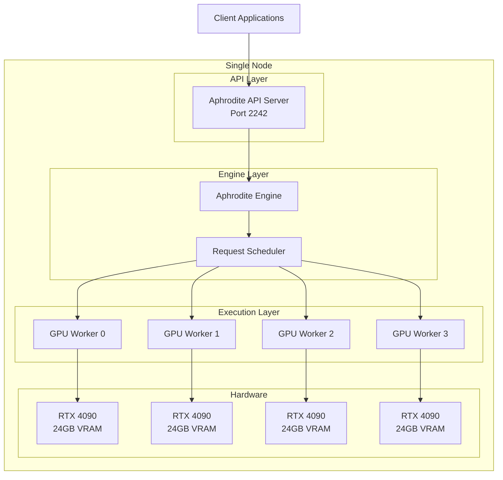
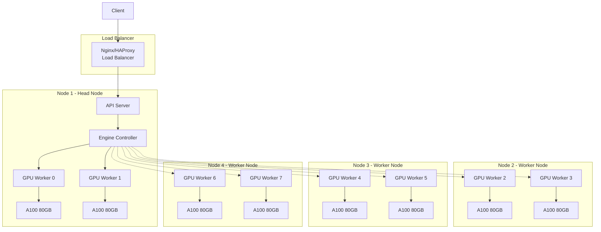
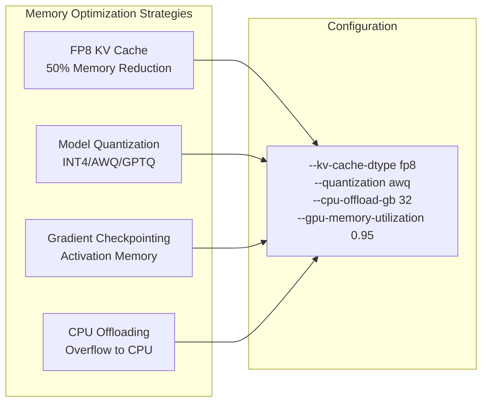
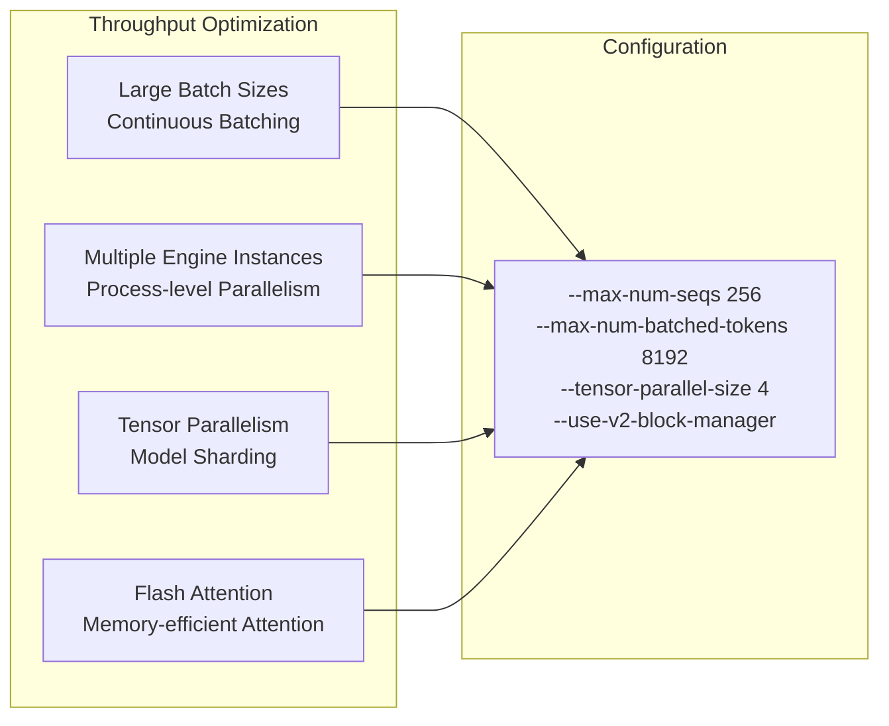

# Deployment Architecture Guide

This guide covers various deployment architectures for Aphrodite Engine, from single-node setups to large-scale distributed deployments.

## Deployment Patterns

### Single Node Deployment

Perfect for development, testing, and small-scale production workloads:



**Command:**
```bash
aphrodite run meta-llama/Meta-Llama-3.1-70B-Instruct \
  --tensor-parallel-size 4 \
  --gpu-memory-utilization 0.9 \
  --max-model-len 4096
```

### Multi-Node Cluster

For large models and high-throughput requirements:



**Head Node:**
```bash
# Start Ray cluster head
ray start --head --port=6379

# Start Aphrodite
aphrodite run meta-llama/Meta-Llama-3.1-405B-Instruct \
  --tensor-parallel-size 8 \
  --pipeline-parallel-size 1 \
  --distributed-executor-backend ray
```

**Worker Nodes:**
```bash
# Join Ray cluster
ray start --address="head_node_ip:6379"
```

## Performance Optimization Deployments

### Memory-Optimized Configuration

For scenarios with limited GPU memory:



### Throughput-Optimized Configuration

For maximum tokens per second:



This deployment guide provides comprehensive patterns for running Aphrodite Engine across different environments and scales, ensuring optimal performance and reliability for your specific use case.