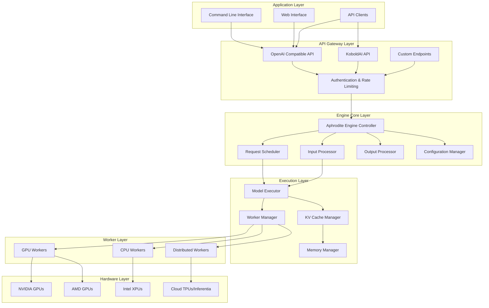
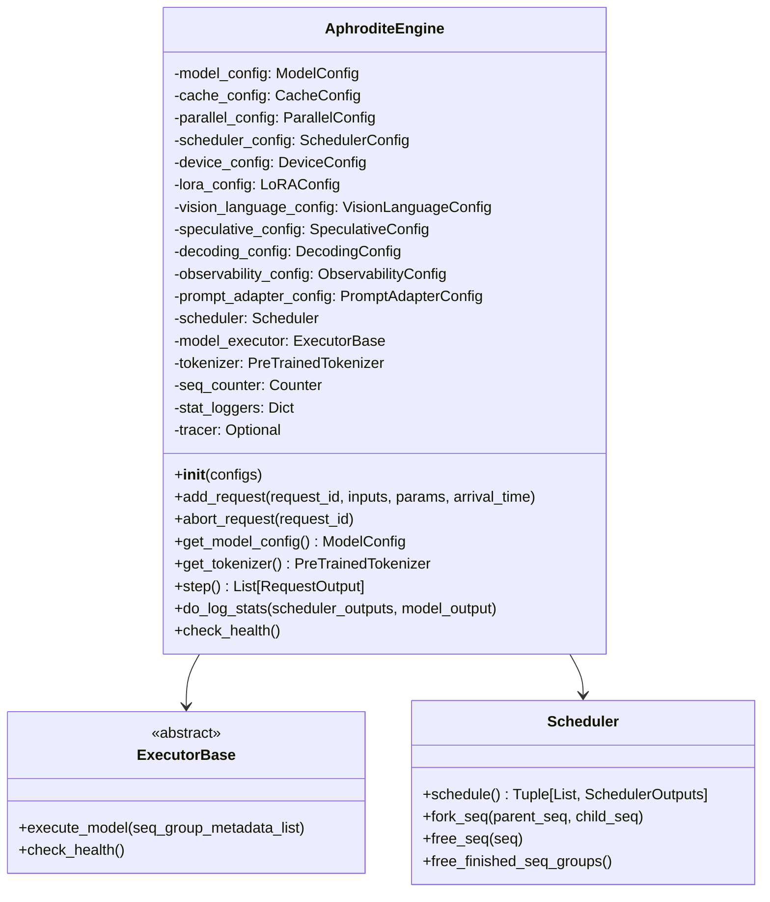
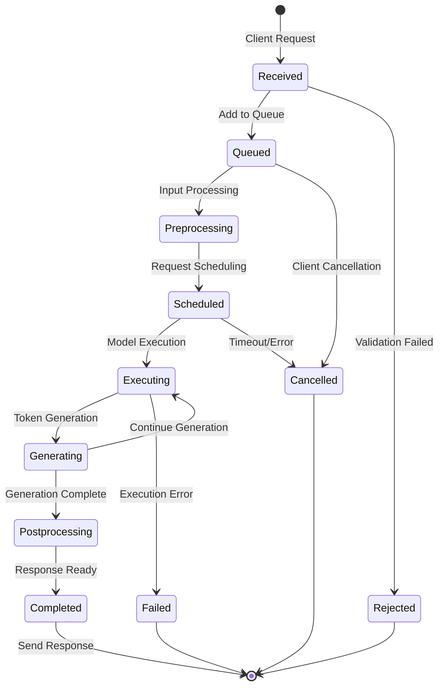
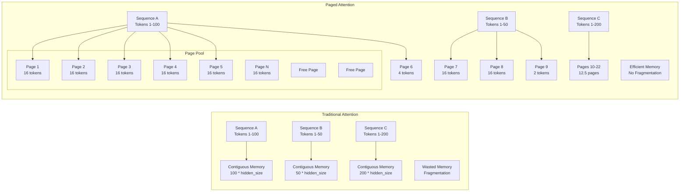
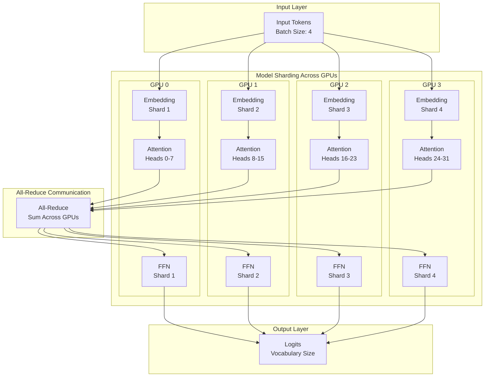
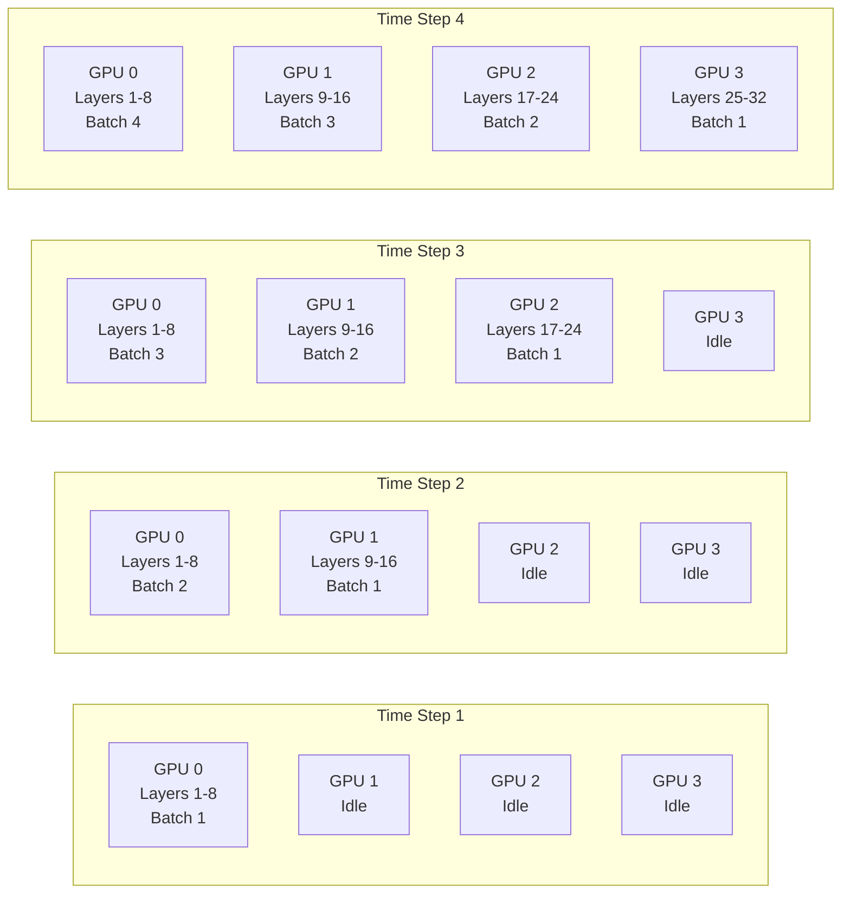
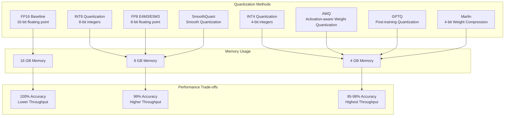
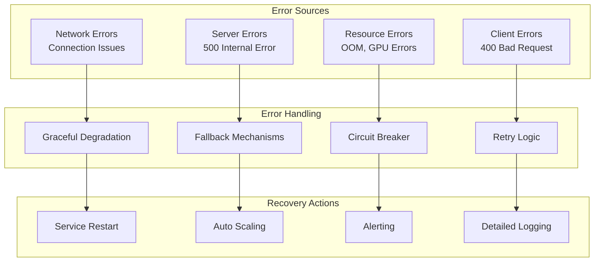
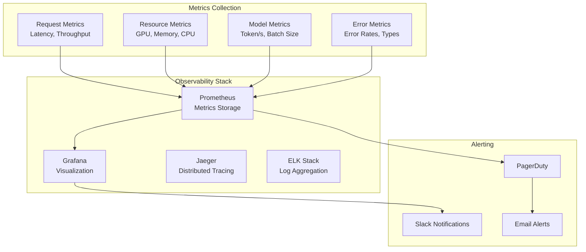
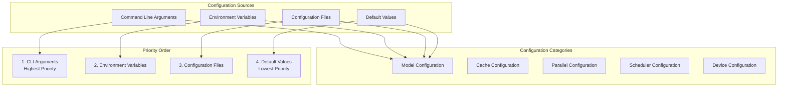

# Aphrodite Engine Architecture

This document provides a comprehensive overview of Aphrodite Engine's architecture, including detailed component interactions, data flows, and design patterns.

## System Overview

Aphrodite Engine is designed as a high-performance, scalable inference system for large language models. The architecture follows a modular design with clear separation of concerns across different layers.



## Core Components

### Engine Controller (AphroditeEngine)

The main orchestrator that coordinates all system components:



### Request Lifecycle

The following diagram shows the complete lifecycle of a request through the system:



### Memory Management Architecture

Aphrodite uses sophisticated memory management for efficient GPU utilization:

```mermaid
graph TB
    subgraph "Memory Hierarchy"
        subgraph "GPU Memory"
            ModelWeights[Model Weights<br/>Read-Only]
            KVCache[KV Cache<br/>Paged Memory]
            TempBuffers[Temporary Buffers<br/>Dynamic]
        end
        
        subgraph "CPU Memory"
            CPUCache[CPU KV Cache<br/>Overflow]
            ModelOffload[Model Offload<br/>When Needed]
        end
        
        subgraph "Storage"
            DiskCache[Disk Cache<br/>Cold Storage]
        end
    end
    
    subgraph "Memory Managers"
        PageManager[Page Manager]
        BlockManager[Block Manager]
        Allocator[Memory Allocator]
    end
    
    subgraph "Cache Operations"
        PageAlloc[Page Allocation]
        PageFree[Page Deallocation]
        PageSwap[CPU ↔ GPU Swap]
    end
    
    PageManager --> PageAlloc
    PageManager --> PageFree
    PageManager --> PageSwap
    
    BlockManager --> KVCache
    BlockManager --> CPUCache
    
    Allocator --> ModelWeights
    Allocator --> TempBuffers
    
    KVCache -.-> CPUCache: Overflow
    CPUCache -.-> DiskCache: Cold Storage
```

### Paged Attention Implementation



## Distributed Execution

### Multi-GPU Tensor Parallelism



### Pipeline Parallelism



## Quantization Support

Aphrodite supports multiple quantization schemes for memory efficiency:



## API Layer Architecture

### OpenAI Compatible API

```mermaid
graph TB
    subgraph "HTTP Endpoints"
        Chat[/v1/chat/completions]
        Completions[/v1/completions]
        Models[/v1/models]
        Embeddings[/v1/embeddings]
        Health[/health]
    end
    
    subgraph "Request Processing"
        Validation[Request Validation]
        Auth[Authentication]
        RateLimit[Rate Limiting]
        Transform[Format Transformation]
    end
    
    subgraph "Engine Interface"
        EngineAdapter[Engine Adapter]
        StreamHandler[Streaming Handler]
        BatchProcessor[Batch Processor]
    end
    
    subgraph "Response Processing"
        Formatter[Response Formatter]
        SSE[Server-Sent Events]
        JSON[JSON Response]
    end
    
    Chat --> Validation
    Completions --> Validation
    Models --> Validation
    Embeddings --> Validation
    
    Validation --> Auth
    Auth --> RateLimit
    RateLimit --> Transform
    
    Transform --> EngineAdapter
    EngineAdapter --> StreamHandler
    EngineAdapter --> BatchProcessor
    
    StreamHandler --> SSE
    BatchProcessor --> JSON
    SSE --> Formatter
    JSON --> Formatter
```

## Error Handling and Resilience



## Monitoring and Observability



## Configuration Management

Aphrodite uses a hierarchical configuration system:



## Performance Optimization Strategies

### Memory Optimization

1. **Paged Attention**: Reduces memory fragmentation
2. **KV Cache Compression**: FP8 quantization for cache
3. **Dynamic Batching**: Optimal memory utilization
4. **Gradient Checkpointing**: Reduced activation memory

### Compute Optimization

1. **Kernel Fusion**: Custom CUDA kernels
2. **Mixed Precision**: FP16/BF16 computation
3. **Flash Attention**: Memory-efficient attention
4. **Continuous Batching**: Higher GPU utilization

### Network Optimization

1. **All-Reduce Optimization**: Efficient parameter synchronization
2. **Pipeline Parallelism**: Overlapped computation and communication
3. **Gradient Compression**: Reduced communication overhead
4. **Smart Scheduling**: Minimized bubble time

This architecture enables Aphrodite to deliver high-performance inference for large language models while maintaining scalability and resource efficiency.