# Troubleshooting Guide with Architecture Insights

This guide helps you diagnose and resolve common issues with Aphrodite Engine by understanding the underlying architecture and component interactions.

## System Architecture for Troubleshooting

Understanding the request flow helps identify where issues might occur:

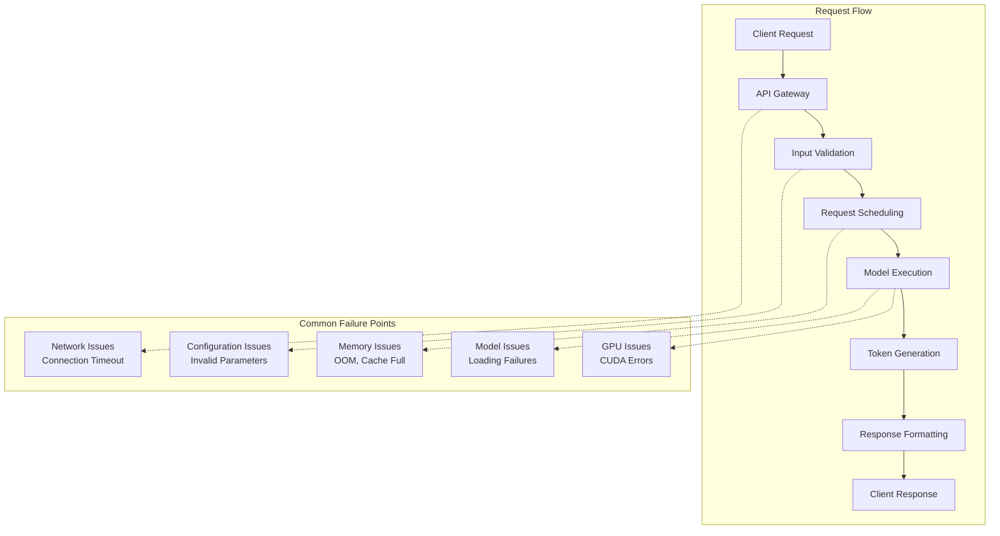

## Memory-Related Issues

### Out of Memory (OOM) Errors

Memory issues are the most common problems in LLM inference:

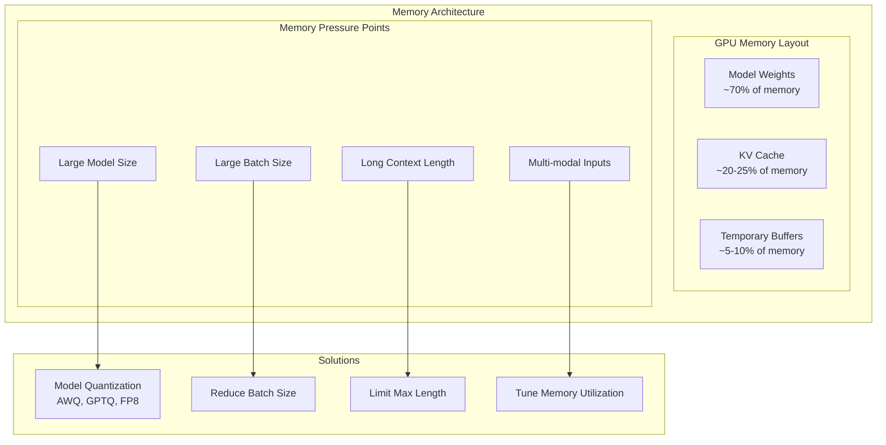

**Diagnostic Commands:**
```bash
# Check GPU memory usage
nvidia-smi

# Monitor Aphrodite memory usage
aphrodite run model_name --gpu-memory-utilization 0.8 --max-model-len 2048
```

**Solutions:**
1. **Reduce Memory Usage:**
   ```bash
   # Use quantization
   aphrodite run model_name --quantization awq
   
   # Reduce batch size
   aphrodite run model_name --max-num-seqs 32
   
   # Limit context length
   aphrodite run model_name --max-model-len 2048
   ```

2. **Use FP8 KV Cache:**
   ```bash
   aphrodite run model_name --kv-cache-dtype fp8
   ```

### KV Cache Management Issues

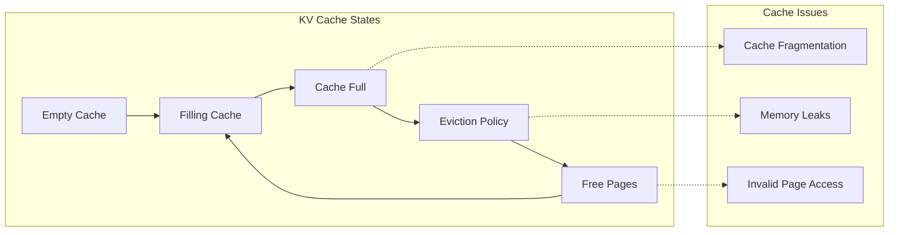

**Diagnostic Signs:**
- Gradually increasing memory usage
- Sudden memory spikes
- Cache-related CUDA errors

**Solutions:**
```bash
# Enable prefix caching for efficiency
aphrodite run model_name --enable-prefix-caching

# Use block manager v2 for better memory management
aphrodite run model_name --use-v2-block-manager
```

## GPU and CUDA Issues

### CUDA Errors

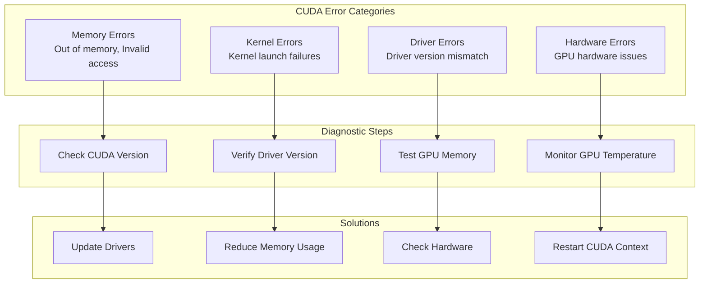

**Diagnostic Commands:**
```bash
# Check CUDA version
nvcc --version

# Check GPU status
nvidia-smi -q

# Test GPU memory
python -c "import torch; print(torch.cuda.is_available()); print(torch.cuda.get_device_properties(0))"
```

### Multi-GPU Communication Issues

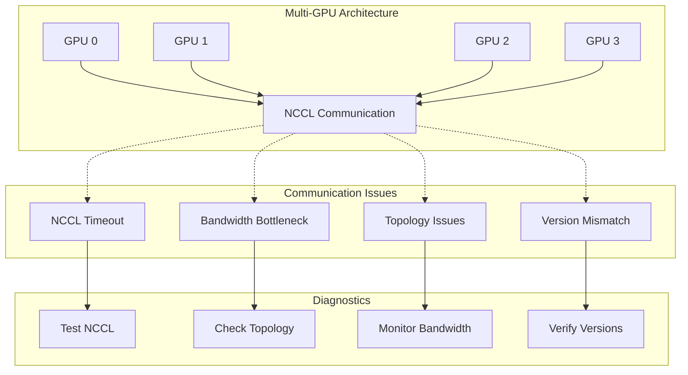

**Test NCCL Communication:**
```python
# Test PyTorch NCCL
import torch
import torch.distributed as dist
dist.init_process_group(backend="nccl")
local_rank = dist.get_rank() % torch.cuda.device_count()
torch.cuda.set_device(local_rank)
data = torch.FloatTensor([1,] * 128).to("cuda")
dist.all_reduce(data, op=dist.ReduceOp.SUM)
print("NCCL test successful!")
```

## Model Loading Issues

### Model Loading Flow

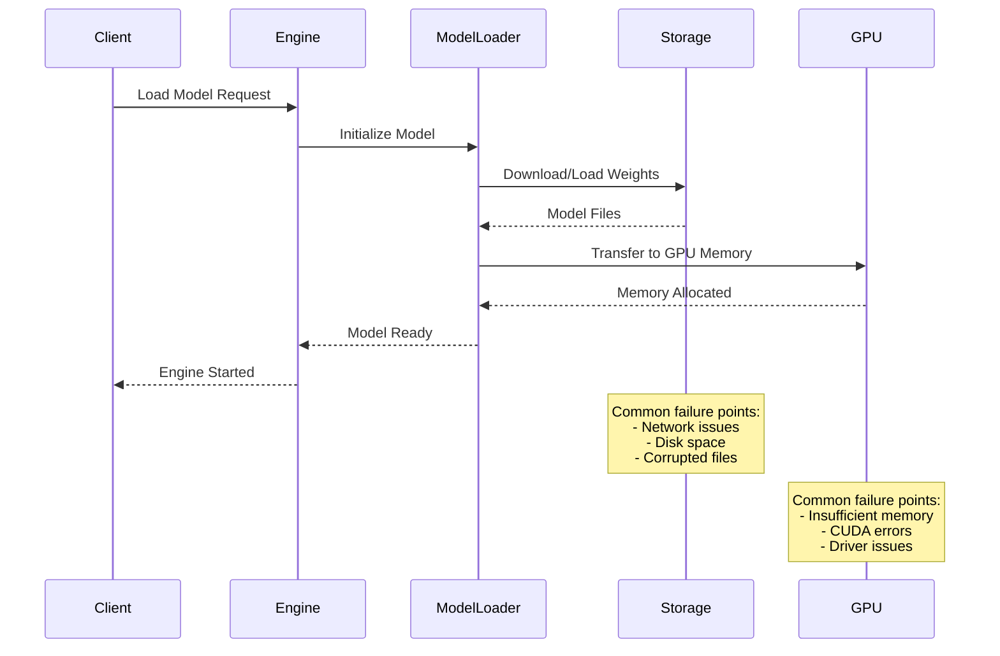

**Common Model Loading Issues:**

1. **Insufficient Disk Space:**
   ```bash
   # Check disk space
   df -h
   
   # Clean up cached models
   rm -rf ~/.cache/huggingface/hub/*
   ```

2. **Network Issues:**
   ```bash
   # Download model beforehand
   huggingface-cli download model_name
   
   # Use local path
   aphrodite run /path/to/local/model
   ```

3. **Permission Issues:**
   ```bash
   # Fix permissions
   sudo chown -R $USER:$USER ~/.cache/huggingface
   ```

## Performance Issues

### Latency Troubleshooting

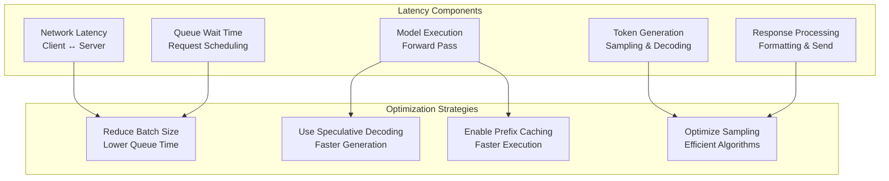

**Latency Optimization:**
```bash
# Optimize for latency
aphrodite run model_name \
  --max-num-seqs 1 \
  --enable-prefix-caching \
  --speculative-model small_model \
  --enforce-eager
```

### Throughput Issues

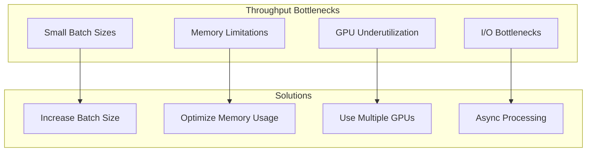

**Throughput Optimization:**
```bash
# Optimize for throughput
aphrodite run model_name \
  --max-num-seqs 256 \
  --max-num-batched-tokens 8192 \
  --tensor-parallel-size 4
```

## API and Networking Issues

### API Request Flow

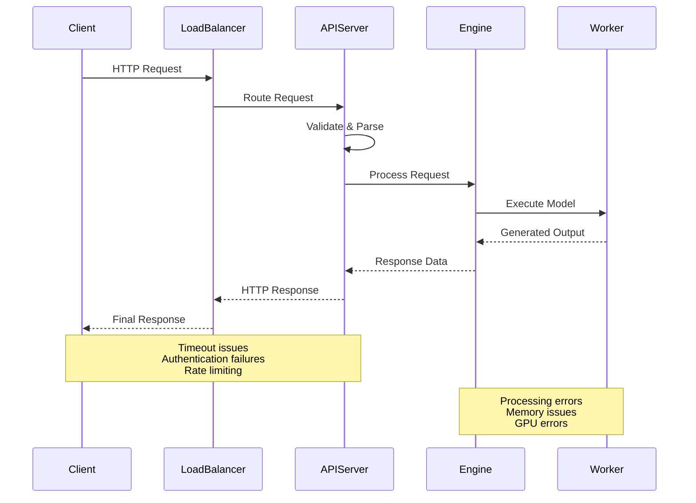

**Common API Issues:**

1. **Connection Timeouts:**
   ```bash
   # Increase timeout values
   aphrodite run model_name --timeout 300
   ```

2. **Rate Limiting:**
   ```bash
   # Adjust rate limits
   aphrodite run model_name --max-requests-per-minute 1000
   ```

3. **Authentication Issues:**
   ```bash
   # Set API keys
   aphrodite run model_name --api-keys "sk-key1,sk-key2"
   ```

## Monitoring and Diagnostics

### Health Check Architecture

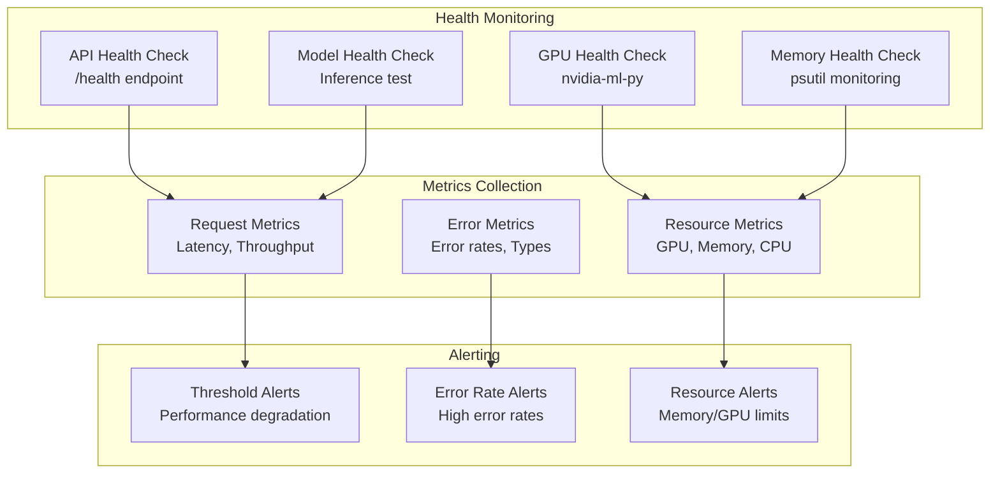

**Monitoring Commands:**
```bash
# Check API health
curl http://localhost:2242/health

# Monitor GPU usage
watch -n 1 nvidia-smi

# Monitor process resources
htop -p $(pgrep -f aphrodite)
```

## Advanced Debugging

### Debug Mode Configuration

```bash
# Enable debug logging
APHRODITE_LOG_LEVEL=DEBUG aphrodite run model_name

# Profile memory usage
APHRODITE_PROFILE_MEMORY=1 aphrodite run model_name

# Enable CUDA debugging
CUDA_LAUNCH_BLOCKING=1 aphrodite run model_name
```

### Debugging Distributed Setups

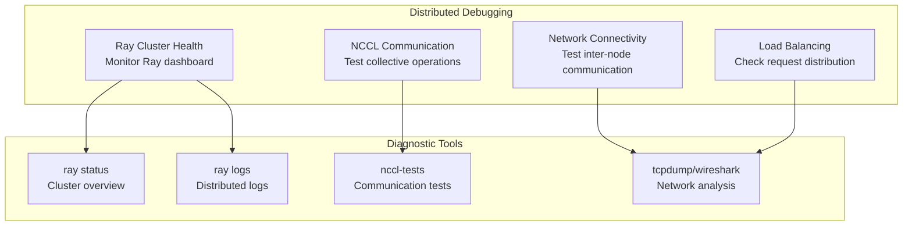

This troubleshooting guide provides architectural context to help you understand and resolve issues more effectively by understanding how components interact within the Aphrodite Engine system.